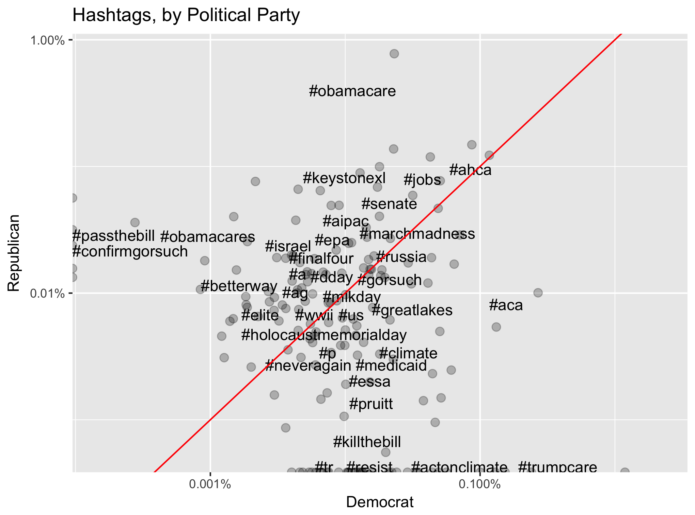
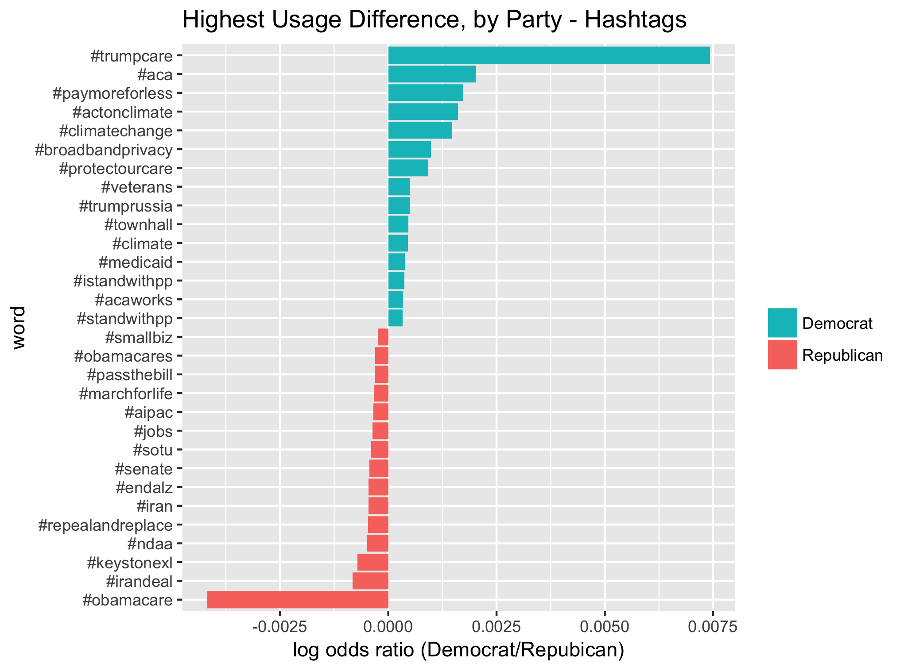

# TweetPredictor
Can we predict the political party of a twitter user?        
We fit a logistic model to classify and make inferences on the political party of politician's twitters. 

## PCA & Clustering

## Native Logistic Model

    ## [1] 0.05140878

Consideration
-------------

Skree plot - are there exactly 2 parties?

Consideration Continued
-----------------------

Weaknesses of Previous Model
----------------------------

-   Naive

Improved Model (Trees)
----------------------

    ## [1] 506 253 126  63  32  16   8   4   1

Visualize Improved Model
------------------------

Outliers & Interesting Things
-----------------------------

-   Who are these users scoring extremely low on PC1 and PC2?
-   What are the 5-clusters encoding? What’s up with the density on
    cluster 3?

Method Continued
----------------

To expand upon this research question, “Can you predict the political
party of a twitter user using their tweet history,” some improvements
could be made:

-   Training and testing on members of the population to make a model
    that works more generally, instead of on politicians due to charged
    language.
-   Considering different scalings of the data such as quantile-based
    instead of ratio-based numerics.
-   

Fun Takeaways
-------------

Fun Takeaways
-------------

Fun Takeaways
-------------

